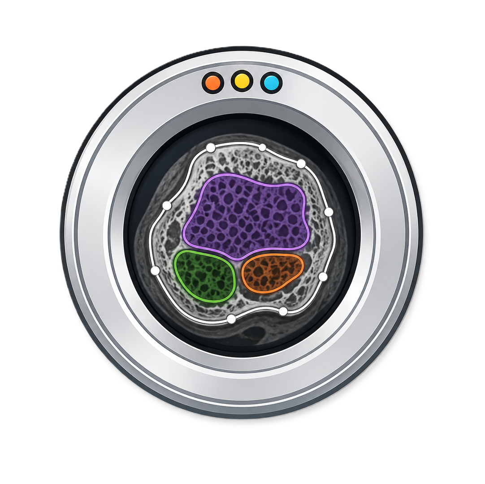

<p align="center">
  
</p>

# bone-contouring

SimpleITK-first bone contouring and mask generation for volumetric bone images.

Standard contouring: Matthias Walle. Optional U-Net method and trained model:
Nathan J. Neeteson, Bryce A. Besler, Danielle E. Whittier and Steven K. Boyd.

## Published HR-pQCT U-Net (optional)

Install `pip install 'bone-contouring[unet]'` to use the fixed-default published
61 µm radius/tibia model. The base package does not require PyTorch, scikit-image
or aimio-py. No Bonelab or vtkbone is required.

```bash
bone-contouring unet /data/raw --output /data/results --device auto
ssh host 'bone-contouring unet /data/raw --output /data/results --device cuda'
```

```python
from bone_contouring.unet import Segmenter
masks = Segmenter(device="auto").segment(density_zyx)  # calibrated mg HA/cm³
```

Devices: auto (CUDA → MPS → CPU), cpu, cuda, mps. Explicit unavailable devices
fail clearly. The only inference control is device; published preprocessing,
five-slice channels, model and morphology are unchanged. XCT-I and knee accuracy,
and equivalence to scanner/IPL contours, are not established.

Post-processing runs on the CPU even when inference uses CUDA/MPS. Repeated
erosions/dilations are batched into compiled SciPy iterations with the same
3D connectivity, border handling, padding and iteration counts; no smoothing
or compartment defaults are reduced. Progress reports the four morphology
stages and their total elapsed time. A read-only source-checkout benchmark
compares masks voxel-for-voxel against the published implementation:

```bash
python benchmarks/benchmark_unet_postprocessing.py
```

First use downloads SHA256-verified `radius_tibia_final.pth` to the shared cache.
Use `HRPQCT_SEGMENTATION_MODEL_DIR` to share a pre-provisioned cache, or
`HRPQCT_SEGMENTATION_WEIGHTS` for a verified explicit weights file. Slicer stores
weights in its application data `HRpQCTSegmentation/models`, beside MotionScore.
Setup installs dependencies, not model weights.

The CLI writes native 0/127 full/trab/cort AIM **compartment** masks with original
geometry and standard BoneContours names, individual provenance sidecars and a
`_UNET.json` completion marker. It never overwrites existing artifacts and reuses
one model per batch. Complete files are published atomically; interrupted cases
without a valid completion marker are withheld by derivative discovery.
These are not bone-tissue SEG masks. Standard batch contouring can add missing
SEG/material labels while preserving these compartments. Slicer imports all three
roles into one segmentation node and additionally publishes the dataset manifest.

Code is GPL-3.0-only from version 0.3.0; previously distributed MIT versions retain
their original terms. See LICENSE and NOTICE for notices and upstream credit.
The original inference draft also retains GPL-3.0-only; it need not be published
as another PyPI package.

Method: [Neeteson et al., Scientific Reports 13, 252 (2023)](https://doi.org/10.1038/s41598-022-27350-0).
Original code: [Bonelab/HR-pQCT-Segmentation](https://github.com/Bonelab/HR-pQCT-Segmentation).
Published weights: [Zenodo](https://zenodo.org/records/14755838).

```python
from bone_contouring import generate_masks_from_image, resolve_preset

masks = generate_masks_from_image(image, resolve_preset(modality="xct1", site="radius"))
```

For manually configured images, use `resolve_preset(modality="custom", site="none",
segmentation="gauss")` and set thresholds in the input image's units. Custom
recipes do not apply XCTII radius/tibia threshold calibration. Users can save
their own named profiles (for example, for micro-CT) for scene and batch use;
there is no built-in micro-CT preset.

## Experimental Buie dual-threshold contours

The opt-in `buie` stages implement the filter sequence in Buie et al.,
[Bone 41 (2007), Fig. 1](https://doi.org/10.1016/j.bone.2007.07.007).
They do **not** replace the default `standard` stages or claim voxel-identical
IPL output. Select both stages for the complete dual-threshold sequence:

```python
params = resolve_preset(
    modality="xct2", site="tibia", segmentation="gauss",
    outer_contour="buie", inner_contour="buie",
)
# These thresholds are starting values in the INPUT IMAGE'S units, not the
# original paper's native scanner gray values or validated XCT2 IPL settings.
params.outer.periosteal_threshold = 300.0
params.inner.endosteal_threshold = 500.0
masks = generate_masks_from_image(density_image, params)
```

Contours threshold the original density image independently of final bone
segmentation. Standard adaptive thresholds, Gaussian prefilters, peel, and
segmentation-aligned contour support are ignored by the selected Buie stage.
Do not supply a native-gray image while interpreting thresholds as mg HA/cm³.

Gaussian **tissue segmentation** defaults to a single filter of the original
density image with sigma **1.2 voxels**, followed by thresholds of **320 mg HA/cm³
in trabecular** and **450 mg HA/cm³ in cortical** compartments. Sigma is scaled
by the smallest voxel spacing; it is not specified in millimetres. Contour
prefilters and signed-distance smoothing are separate and do not pre-smooth
the tissue input. Explicit custom-profile settings remain unchanged.
Tissue SEG retains disconnected bone components; largest-component selection
belongs to downstream FEA preparation and is never applied here. The legacy
`segmentation.keep_largest_component` field is accepted but ignored, including
in saved profiles. The separate 64-voxel minimum-component noise filter remains.

`params.buie` exposes median dimensions `(3,3,1)`, periosteal morphology
dimensions `(15,15,1)`, endosteal morphology dimensions `(10,10,1)`, Gaussian
sigma `3` voxels, support/radius factors `(3,3,1)`, final lower threshold `100`,
and connectivity (6-connected by default, 26 with `fully_connected=True`).
Kernel dimensions are **not radii** and are not automatically rescaled for
scanner resolution. Morphology and median filtering are in-plane by default;
connectivity is volumetric. The Gaussian interpretation is volumetric, with
radii `floor(sigma * radius_factor)` = `(9,9,3)`. This is the VTK interpretation
of the paper's support notation; the original implementation/source and IPL
script parameters have not been recovered to confirm all conventions.

The binary Gaussian input is white exterior `255`, black marrow `0`. Trabecular
ROI is `smoothed_exterior < 100`, intersected with the periosteal ROI; cortical
ROI is its exact complement inside that ROI. Uint8 intermediate smoothing uses
z/y/x axis order and clipped-kernel normalization. Roundoff within `1e-10`
below an integer is snapped before truncation; bitwise VTK equivalence at
numerical ties is not promised.

Morphology uses VTK-style ellipsoids, including the even-kernel anchor
`floor(size/2)`. Outside samples are neutral. Median boundary handling is nearest
replication. The exterior is the largest background component touching the XY
perimeter; scan ends are not padded with exterior. Additional bones should be
excluded from the input ROI: this path does not silently keep only the largest
bone or use a trabecular fallback. Open cortical shells, disconnected marrow,
and dense structures may still yield holes or empty marrow; these are not
silently repaired. Metadata records settings, stage timings, and empty marrow.

SciPy's compiled filters execute the stages. In-plane ellipsoids are decomposed
exactly into row intervals with compiled running max/min filters; no voxel
downsampling, Python voxel loop, or Cython build is required.

### Read-only native compartment benchmark

The benchmark uses only genuine `FULL_MASK`/`CORT_MASK` pairs, verifies their
GOBJ mask provenance, derives reference trabecular ROI as full minus cortex,
and compares against saved standard contours on the same physical grid.
GOBJ provenance confirms compartment masks, **not** the contour-generation
algorithm, its thresholds, or whether manual corrections were performed.
LH bone tissue segmentations are excluded. The benchmark calls the image API
directly: ordinary batch generation can reuse existing contours rather than
recompute them, even when a different method is requested.

```sh
python benchmarks/benchmark_buie.py \
  --dataset-root /path/to/UCSF_REPRO_pipeline \
  --output-dir /path/to/separate/results \
  --aimio-path /path/to/aimio-py
```

Optional `--outer-threshold`, `--inner-threshold`, and `--limit` control the
experiment. It writes only new result JSON/CSV, never input scans or masks.
Metrics include compartment Dice, volume bias, holes, and axial symmetric
boundary distances (mm, excluding artificial scan-end cap surfaces).
Each case runs in a fresh process. Peak RSS includes input reading and the
image API, not just filter allocations; API timing excludes reference comparison
and input reading, and disables final bone-tissue segmentation.

## Experimental IPL-matching hybrid

`ipl_match` is a separate image-only candidate whose goal is agreement with
native compartment masks, **not** literal Buie fidelity or guaranteed IPL
equivalence. Neither the defaults nor the `buie` stages are replaced.

```python
params = resolve_preset(
    modality="xct2", site="tibia", segmentation="gauss",
    outer_contour="ipl_match", inner_contour="ipl_match",
)
masks = generate_masks_from_image(density_image, params)
```

The outer stage reuses standard Gaussian/component/axial cleanup: density
prefilter sigma `0.8` (voxel-relative), threshold `320` mg HA/cm³, largest
6-connected bone, axial closing radius `5`, opening radius `2`, and axial
hole filling for XCT2. It uses `params.outer` independently of segmentation
support, regardless of segmentation being enabled or its tissue thresholds.
Adaptive thresholding is deliberately not used for this stage.

The inner stage thresholds **raw density** below `500` inside an axially
peeled full ROI (`params.inner.peel=3`), selects the largest marrow component,
then applies the shared `params.buie` endosteal closing/connectivity/Gaussian
stages. After thresholding white exterior below `100`, it fills axial holes
and clips to the peeled ROI. Cortex is the exact complement inside full.
There is no synthetic all-trabecular fallback; empty marrow is recorded.
The Gaussian prefilter and site close-radius fields in `params.inner` do not
control this variant; smoothing after closing is controlled by `params.buie`.
The two stages can also be selected independently.

These are explicit departures from the paper: Gaussian filtering and
primary-bone selection for the outer ROI, a periosteal peel, primary-marrow
selection before closing, and final axial hole filling. Morphology/peel/fill
remain in-plane; component selection is volumetric (6-connected by default,
26-connected for marrow with `params.buie.fully_connected=True`), and the
shared Gaussian has volumetric support. Metadata records these departures,
stage timings, selected component sizes, and filled-hole voxel counts.

Only calibrated XCT2 tibia data have been investigated. This is a single-bone
method; axial filling can erase genuine holes or bridges and is not suitable
for arbitrary anatomy without further validation. Do not call this recovered
Scanco code, or claim exact matching: the original IPL recipe and any manual
corrections remain unknown. The Slicer wrapper and shipped profiles are
unchanged. Batch mode may reuse existing masks, so use the image API to force
generation when comparing algorithms.

The same read-only benchmark can compare this variant:

```sh
python benchmarks/benchmark_buie.py \
  --dataset-root /path/to/UCSF_REPRO_pipeline \
  --output-dir /path/to/separate/results \
  --aimio-path /path/to/aimio-py --method ipl_match
```

This writes `ipl_match_benchmark.json` and `ipl_match_benchmark.csv`, without
overwriting the Buie results or any input images/masks. Threshold overrides
are optional; by default the chosen method's preset values are used.

## Standard contouring: topology-first across XCTI, XCTII, and knee

`standard` now uses one topology-first contouring path across XCTI and XCTII,
for radius, tibia, and knee, including shipped profiles and the Slicer adapter.
There is no legacy standard selector. Input must represent one target bone:
largest-component selection is not multi-bone knee segmentation. Native-mask
comparisons currently cover XCTII radius/tibia, not XCTI or knee. The explicit `stable_3d`
stage names still address the same implementation for method-development use.
This is a departure from literal Buie, **not** a recovered or equivalent IPL recipe.

```python
params = resolve_preset(
    modality="xct2", site="radius", segmentation="gauss",
    outer_contour="standard", inner_contour="standard",
)
masks = generate_masks_from_image(density_image, params)
```

The outer stage independently filters and thresholds calibrated density using
the effective preset settings, selects the largest 6-connected bone component,
closes in XY, and fills axial holes. XCTII radius/tibia defaults remain sigma
`0.8` voxel-relative and threshold `320` mg HA/cm³; other presets retain their
existing density thresholds, Gaussian sigmas, and outer closing radii. It deliberately
omits the legacy pre-fill opening: that operation can break a thin shell and
prevent marrow filling. The ignored outer controls are `periosteal_open_radius`,
`fill_holes`, and `use_adaptive_threshold`.

The inner stage independently filters density, thresholds below its configured
endosteal threshold inside full, keeps the largest 3D marrow component, dilates
with the configured ellipsoidal **dimension** footprint, fills axial holes, then erodes
with the same footprint and clips to full. `params.buie.endosteal_kernel_size`
and `fully_connected` control these operations. After distance smoothing and final
hole filling, trab is constrained to an XY-eroded full ROI (`inner.peel=3` by
default), preserving a minimum cortical **compartment** rim without peeling Z
end slices. This is not a measured cortical bone thickness or a requirement of
the original Buie method. Set `inner.peel=0` explicitly to disable the constraint.
`trabecular_close_radius`, `endosteal_kernel_size`, and `use_adaptive_threshold`
do not control this method. Other Buie smoothing and
median/periosteal fields are not used. The threshold and closing candidate were
selected using radius C1 development comparisons: XCTII radius/tibia use sigma
`0.8`, threshold `380`, and footprint `(31, 31, 1)`. XCTI and knee preserve their
existing density settings and use the existing Buie block default `(10, 10, 1)`
unless explicitly overridden. This footprint replaces the old trabecular closing
radius; it does not reproduce that legacy morphology or establish optimal settings
for XCTI/knee. These voxel-sized settings are not resolution-independent.

Both resulting envelopes are regularized with a symmetric physical signed
distance field and a 3D Gaussian. `params.stable_3d.outer_sigma_mm` and
`inner_sigma_mm` default to `(0.03, 0.03, 0.06)` in input **XYZ** axes, in mm.
The through-slice sigma is half the earlier experimental candidate's value.
XYZ refers to scan axes, not world axes; the third axis must be the stack axis.
No artificial exterior caps are introduced at the scan ends. Changes are limited
to voxels within `max_boundary_shift_mm=0.12` of the original field boundary.
This is a local change-band restriction, **not** a Hausdorff displacement,
topology, or volume guarantee; it also does not bound the earlier repair stages.
Zero smoothing sigma or a zero change-band limit disables regularization.
Closing and filling remain axial; this is not full-3D morphological closing.
Final axial filling removes enclosed holes reintroduced by regularization,
followed by clipping trabecular ROI to the XY-peeled full ROI. The final filling is an envelope
repair, not a boundary-displacement guarantee.
Cortex is exactly full minus trabecular ROI, including any disconnected remnants.

Metadata includes effective settings, timings, seed sizes, and advisory QA for
empty/fragmented slices, axial holes, crop contact, area jumps, and adjacent
boundary jumps. Warnings neither trigger a synthetic fallback nor establish
anatomical correctness; true anatomy, motion, or a cropped input can trigger them.
The absence of warnings is also not proof of correctness. Inspect the input and
contours, especially when trabecular ROI reaches the outer boundary.

Use calibrated density and the image API to force regeneration. Existing batch
mask reuse is unchanged; existing masks are not automatically regenerated.
Settings hashes and provenance include `standard_algorithm=topology_first_v2`
and the effective kernel/regularization settings for the replacement standard.
Tissue-segmentation methods/settings are unchanged; their contour-support
override no longer drives this standard's envelopes. Select `--method standard` in the read-only benchmark
above to produce separate results. Adjacent-boundary metrics measure envelope
movement in mm (including anatomy/motion), with omitted empty pairs counted;
they complement, rather than replace, native overlap and cortical-volume bias.
